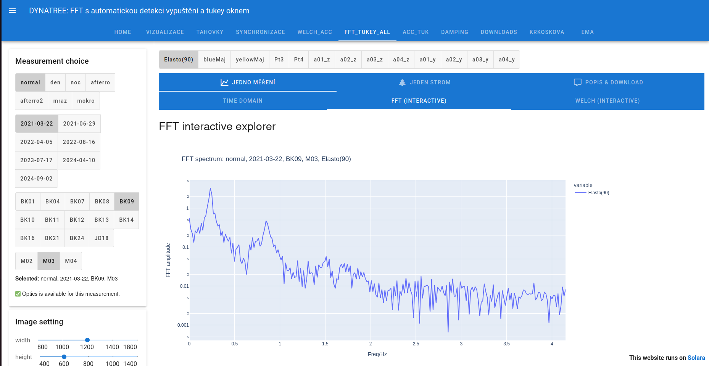

# DYNATREE

The repository contains script required to process and visialize data
obtained as a part of the ERC CZ project DYNATREE - Tree Dynamics: Understanding of Mechanical Response to Loading. 

The simplest method how to run these scripts on your computer is via Docker container, see
the Docker subdirectory. (Note the speed degradation in Windows-like OS when acessing data outside of 
the container. Use Linux if possible.)
